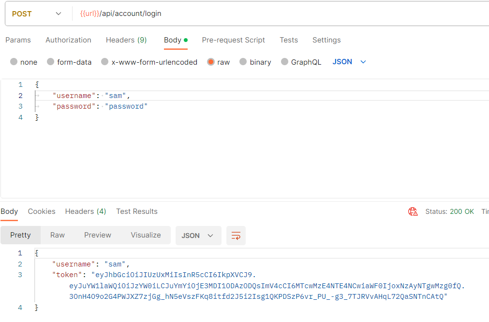
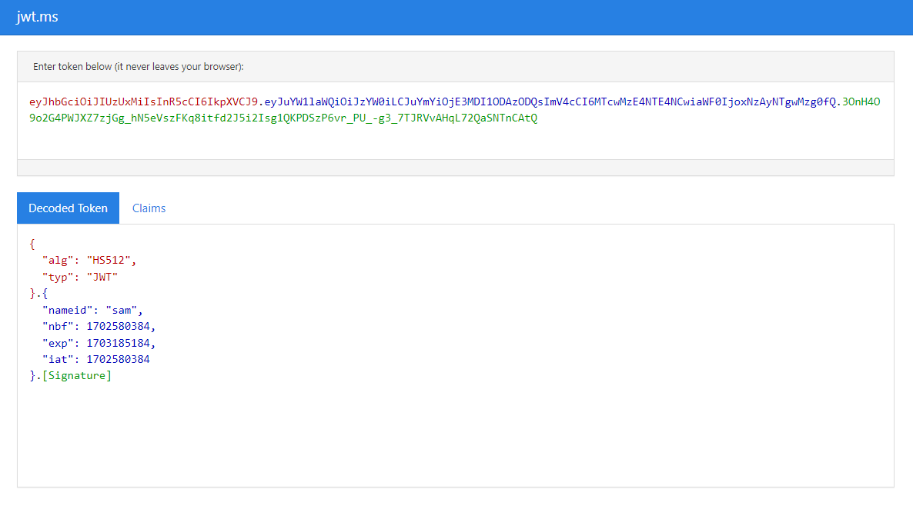
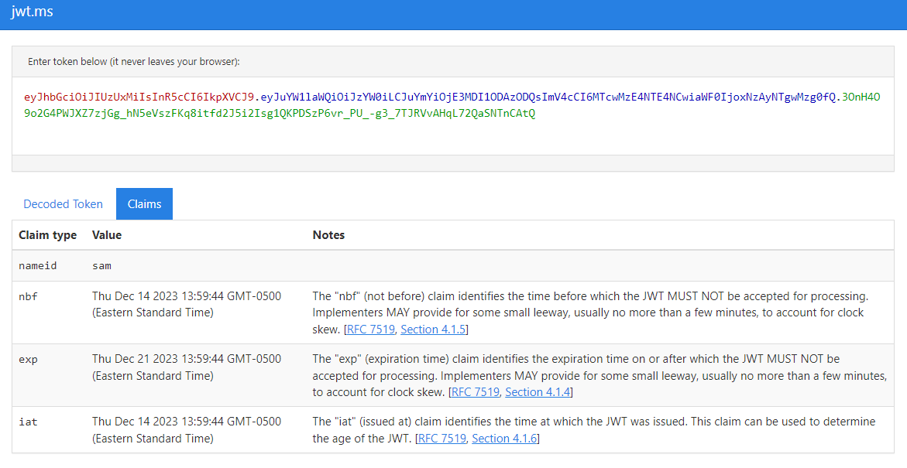

# JSON Web Token Notes

## Notes:

- Will we be able to access local browser storage on the production network?

## Added `PasswordHash` and `PasswordSalt` to AppUser Entity

```csharp
namespace API.Entities;

public class AppUser
{
  public int Id { get; set; }
  public string UserName { get; set; }
  public byte[] PasswordHash { get; set; }
  public byte[] PasswordSalt { get; set; }
}
```

### Added UserPassword Migration and Updated db

`dotnet ef migrations add UserPasswordAdded`\
`dotnet ef database update`

### Added BaseApiController

```csharp
using Microsoft.AspNetCore.Mvc;

namespace API.Controllers;

[ApiController]
[Route("api/[controller]")]
public class BaseApiController : ControllerBase
{

}
```

### Set UserController to inherit from BaseApiController

```csharp
using Microsoft.AspNetCore.Mvc;
using Microsoft.EntityFrameworkCore;

namespace API.Controllers;

public class UsersController : BaseApiController
{
  private readonly DataContext _context;
```

### Add RegisterDto to be used by the AccountController Register() Method

```csharp
using System.ComponentModel.DataAnnotations;

namespace API.Dtos;

public class RegisterDto
{
  [Required]
  public string Username { get; set; }
  [Required]
  public string Password { get; set; }
}
```

### Add LoginDto to be used by the AccountController Login() Method

```csharp
namespace API.Dtos;

public class LoginDto
{
  public string Username { get; set; }
  public string Password { get; set; }
}

```

### Add AccountController with Register() and Login() methods

```csharp
using System.Security.Cryptography;
using System.Text;
using API.Data;
using API.Dtos;
using API.Entities;
using API.Interfaces;
using Microsoft.AspNetCore.Mvc;
using Microsoft.EntityFrameworkCore;

namespace API.Controllers;

public class AccountController : BaseApiController
{
  private readonly DataContext _context;
  private readonly ITokenService _tokenService;

  public AccountController(DataContext context, ITokenService tokenService)
  {
    _context = context;
    _tokenService = tokenService;
  }

  [HttpPost("register")]
  public async Task<ActionResult<UserDto>> Register(RegisterDto registerDto)
  {
    if (await UserExists(registerDto.Username)) return BadRequest("Username is taken");

    using var hmac = new HMACSHA512();

    var user = new AppUser
    {
      UserName = registerDto.Username.ToLower(),
      PasswordHash = hmac.ComputeHash(Encoding.UTF8.GetBytes(registerDto.Password)),
      PasswordSalt = hmac.Key
    };

    _context.Users.Add(user);
    await _context.SaveChangesAsync();

    return new UserDto
    {
      Username = user.UserName,
      Token = _tokenService.CreateToken(user)
    };
  }

  [HttpPost("login")]
  public async Task<ActionResult<UserDto>> Login(LoginDto loginDto)
  {
    var user = await _context.Users.SingleOrDefaultAsync(x => x.UserName == loginDto.Username);

    if (user == null) return Unauthorized("Invalid username");

    using var hmac = new HMACSHA512(user.PasswordSalt);

    var computeHash = hmac.ComputeHash(Encoding.UTF8.GetBytes(loginDto.Password));

    for (int i = 0; i < computeHash.Length; i++)
    {
      if (computeHash[i] != user.PasswordHash[i]) return Unauthorized("Invalid password");
    }

    return new UserDto
    {
      Username = user.UserName,
      Token = _tokenService.CreateToken(user)
    };
  }

  private async Task<bool> UserExists(string username)
  {
    return await _context.Users.AnyAsync(x => x.UserName == username.ToLower());
  }
}
```

### Token Service

#### Add Token Service Interface

```csharp
using API.Entities;

namespace API.Interfaces;

public interface ITokenService
{
  string CreateToken(AppUser user);
}
```

### Added TokenKey to appsettings.development.json

- Note: Key would probably be a 64+ chararcter random string in production

```csharp
{
  "Logging": {
    "LogLevel": {
      "Default": "Information",
      "Microsoft.AspNetCore": "Information"
    }
  },
  "ConnectionStrings": {
    "DefaultConnection": "Data source=datingapp.db"
  },
  "TokenKey": "19f7d9545d1d45f0b1070be0cdea8d4c7895115fa3fc4fa686937526cc2bfe44"
}

```

#### Add Token Service Implementation

```csharp
using System.IdentityModel.Tokens.Jwt;
using System.Security.Claims;
using System.Text;
using API.Entities;
using API.Interfaces;
using Microsoft.IdentityModel.Tokens;

namespace API.Services;

public class TokenService : ITokenService
{
  private readonly SymmetricSecurityKey _key;
  public TokenService(IConfiguration config)
  {
    _key = new SymmetricSecurityKey(Encoding.UTF8.GetBytes(config["TokenKey"]));
  }
  public string CreateToken(AppUser user)
  {
    var claims = new List<Claim>
    {
      new Claim(JwtRegisteredClaimNames.NameId, user.UserName)
    };

    var creds = new SigningCredentials(_key, SecurityAlgorithms.HmacSha512);

    var tokenDescriptor = new SecurityTokenDescriptor
    {
      Subject = new ClaimsIdentity(claims),
      // Typically short - This indicates that the user would have
      // To log back in after 7 days
      Expires = DateTime.Now.AddDays(7),
      SigningCredentials = creds
    };

    var tokenHandler = new JwtSecurityTokenHandler();

    var token = tokenHandler.CreateToken(tokenDescriptor);

    return tokenHandler.WriteToken(token);

  }
}

```

#### Add Token Services to API Services Collection

##### API Project >> Program.cs

```csharp
builder.Services.AddDbContext<DataContext>(opt =>
{
  opt.UseSqlite(builder.Configuration.GetConnectionString("DefaultConnection"));
});

builder.Services.AddCors();

builder.Services.AddScoped<ITokenService, TokenService>();

var app = builder.Build();
```

### Add NuGet Package System.IdentityModel.Tokens.Jwt

- System.IdentityModel.Tokens.Jwt by Microsoft\
  `Includes types that provide support for creating, serializing and validating JSON Web Tokens.`

### Add UserDto

```csharp
namespace API.Dtos;

public class UserDto
{
public string Username { get; set; }
public string Token { get; set; }
}
```

### Postman Test to View Returned Token



### View Token at jwt.ms

https://jwt.ms/





### Add Authoriztion to UsersController

```csharp
using System.Collections;
using API.Data;
using API.Entities;
using Microsoft.AspNetCore.Authorization;
using Microsoft.AspNetCore.Mvc;
using Microsoft.EntityFrameworkCore;

namespace API.Controllers;
[Authorize]
public class UsersController : BaseApiController
{
  private readonly DataContext _context;

  public UsersController(DataContext context)
  {
    _context = context;
  }

  // Just an example to show how you can allow access to select methods
  [HttpGet]
  public async Task<ActionResult<IEnumerable>> GetUsers()
  {
    return await _context.Users.ToListAsync();
  }

  [HttpGet("{id}")]
  public async Task<ActionResult<AppUser>> GetUser(int id)
  {
    return await _context.Users.FindAsync(id);
  }

  [AllowAnonymous]
  [HttpGet("allowAnonymous")]
  public string AllowAnonymous()
  {
    return "I allow anonymous access";
  }
}
```

### Add NuGet Package Microsoft.AspNetCore.Authentication.JwtBearer

- Microsoft.AspNetCore.Authentication.JwtBearer v7.0.14 by Microsoft\
  `ASP.NET Core middleware that enables an application to receive an OpenID Connect bearer token. This package was built from the source.`
- Note: Version 8 did not work, had to use 7.0.14

#### Add Authentication Service

##### API Project >> Program.cs

```csharp
builder.Services.AddScoped<ITokenService, TokenService>();

builder.Services.AddAuthentication(JwtBearerDefaults.AuthenticationScheme)
  .AddJwtBearer(options =>
  {
    options.TokenValidationParameters = new TokenValidationParameters
    {
      ValidateIssuerSigningKey = true,
      IssuerSigningKey = new SymmetricSecurityKey(Encoding.UTF8.GetBytes(builder.Configuration["TokenKey"])),
      ValidateIssuer = false,
      ValidateAudience = false
    };
  });

var app = builder.Build();
```

#### Add Authentication Middleware

##### API Project >> Program.cs

- Note: Must come before app.MapControllers()

```csharp
var app = builder.Build();

app.UseCors(builder => builder
  .AllowAnyHeader()
  .AllowAnyMethod()
  .WithOrigins("https://localhost:4200"));

app.UseAuthentication();
app.UseAuthorization();

app.MapControllers();
```

### Refactor to move `Applications Services` and `Identity Services` out of `Program.cs` into Extension Methods

#### Add `ApplicationServiceExtensions` and Move Application Services out of `Program.cs`

```csharp
using API.Data;
using API.Interfaces;
using API.Services;
using Microsoft.EntityFrameworkCore;

namespace API.Extensions;

public static class ApplicationServiceExtensions
{
  public static IServiceCollection AddApplicationServices(this IServiceCollection services,
  IConfiguration config)
  {
    services.AddDbContext<DataContext>(opt =>
    {
      opt.UseSqlite(config.GetConnectionString("DefaultConnection"));
    });

    services.AddCors();

    services.AddScoped<ITokenService, TokenService>();

    return services;
  }
}

```

#### Add `IdentityServiceExtensions` Extension Method and Move IdentityServices out of `Program.cs`

```csharp
using System.Text;
using Microsoft.AspNetCore.Authentication.JwtBearer;
using Microsoft.IdentityModel.Tokens;

namespace API.Extensions;

public static class IdentityServiceExtensions
{
  public static IServiceCollection AddIdentityServices(this IServiceCollection services,
    IConfiguration config)
  {
    services.AddAuthentication(JwtBearerDefaults.AuthenticationScheme)
    .AddJwtBearer(options =>
      {
        options.TokenValidationParameters = new TokenValidationParameters
        {
          ValidateIssuerSigningKey = true,
          IssuerSigningKey = new SymmetricSecurityKey(Encoding.UTF8.GetBytes(config["TokenKey"])),
          ValidateIssuer = false,
          ValidateAudience = false
        };
      });

    return services;
  }
}

```

#### Final `Program.cs` with Applications Services and Identity Services moved to Extension Methods

```csharp
using API.Extensions;

var builder = WebApplication.CreateBuilder(args);

// Add services to the container.

builder.Services.AddControllers();
builder.Services.AddApplicationServices(builder.Configuration);
builder.Services.AddIdentityServices(builder.Configuration);

var app = builder.Build();

app.UseCors(builder => builder
  .AllowAnyHeader()
  .AllowAnyMethod()
  .WithOrigins("https://localhost:4200"));

app.UseAuthentication();
app.UseAuthorization();

app.MapControllers();

app.Run();
```

---

## Adding User Token Data to the Browser's Local Storage and Account Service Usage

`account.service.ts`

- login() and register() store the user token data in the browser's local storage
- logout() removes the user token data from browser's local storage

```javascript
import { HttpClient } from '@angular/common/http';
import { Injectable } from '@angular/core';
import { BehaviorSubject, map } from 'rxjs';
import { User } from '../_models/user';

@Injectable({
  providedIn: 'root',
})
export class AccountService {
  baseUrl = 'https://localhost:5001/api/';
  private currentUserSource = new BehaviorSubject<User | null>(null);
  currentUser$ = this.currentUserSource.asObservable();

  constructor(private http: HttpClient) {}

  login(model: any) {
    return this.http.post<User>(this.baseUrl + 'account/login', model).pipe(
      map((response: User) => {
        const user = response;
        if (user) {
          localStorage.setItem('user', JSON.stringify(user));
          this.setCurrentUser(user);
        }
      })
    );
  }

  register(model: any) {
    return this.http.post<User>(this.baseUrl + 'account/register', model).pipe(
      map((user) => {
        if (user) {
          localStorage.setItem('user', JSON.stringify(user));
          this.setCurrentUser(user);
        }
      })
    );
  }

  setCurrentUser(user: User) {
    this.currentUserSource.next(user);
  }

  logout() {
    localStorage.removeItem('user');
    this.currentUserSource.next(null);
  }
}

```

`nav.component.ts` using account.service.ts login() and logout()

```javascript
import { Component, OnInit } from '@angular/core';
import { AccountService } from '../_services/account.service';
import { Observable, of } from 'rxjs';
import { User } from '../_models/user';

@Component({
  selector: 'app-nav',
  templateUrl: './nav.component.html',
  styleUrls: ['./nav.component.css'],
})
export class NavComponent implements OnInit {
  model: any = {};

  constructor(public accountService: AccountService) {}

  ngOnInit(): void {
  }

  login() {
    this.accountService.login(this.model).subscribe({
      next: (response) => {
        console.log(response);
      },
      error: (error) => console.log(error),
    });
  }

  logout() {
    this.accountService.logout();
  }
}

```

`register.component.ts` using account.service.ts register()

```javascript
`nav.component.ts` using account.service.ts login() and logout()

```
